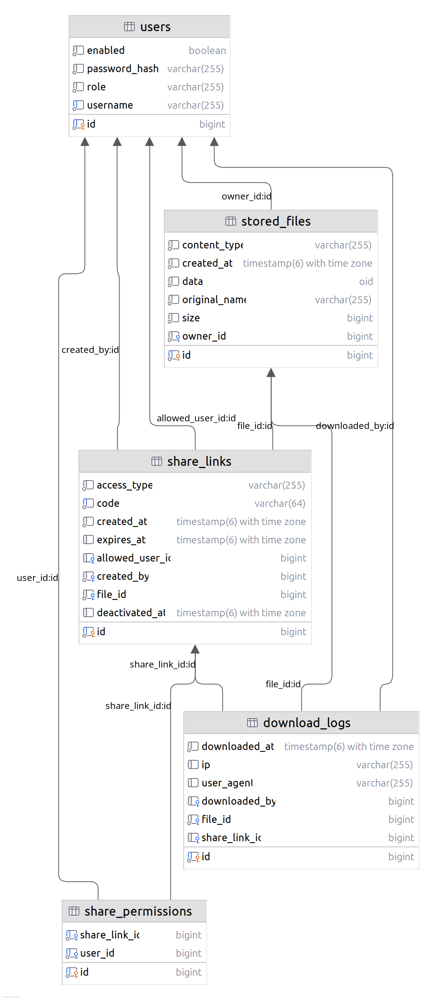

# Ereblink

Webová aplikace Ereblink slouží jako prostor pro jednoduché nahrávání, správu a sdílení souborů. Cílem je nabídnout přehledné webové rozhraní, ve kterém mohou uživatelé pracovat se svými soubory, sdílet je s dalšími lidmi a mít základní kontrolu nad přístupem.

## 1. Struktura projektu

Projekt je rozdělený na dvě hlavní části:

- `frontend` - webové uživatelské rozhraní
- `backend` - serverová část aplikace a API

Součástí repozitáře je také `docker-compose.yml` pro lokální spuštění databáze PostgreSQL.

## 2. Použité technologie

- Frontend: React, TypeScript, Vite
- Backend: Kotlin, Spring Boot
- Databáze: PostgreSQL

## 3. Databázový model

### 1. users
Reprezentuje uživatele systému.

- `id` – primární klíč (identifikátor uživatele)
- `username` – uživatelské jméno
- `password_hash` – hash hesla
- `role` – role uživatele (např. admin, user)
- `enabled` – zda je účet aktivní

---

### 2. stored_files
Obsahuje metadata a data uložených souborů.

- `id` – primární klíč
- `original_name` – původní název souboru
- `content_type` – MIME typ
- `size` – velikost souboru
- `data` – samotná data
- `created_at` – čas vytvoření
- `owner_id` – cizí klíč na `users`

---

### 3. share_links
Reprezentuje odkazy pro sdílení souborů.

- `id` – primární klíč
- `code` – unikátní kód odkazu
- `access_type` – typ přístupu
- `created_at` – vytvoření odkazu
- `expires_at` – expirace odkazu
- `deactivated_at` – deaktivace odkazu
- `file_id` – cizí klíč na `stored_files`
- `created_by` – cizí klíč na `users` (autor odkazu)
- `allowed_user_id` – konkrétní uživatel s přístupem

### 4. download_logs
Záznamy o stažení souborů.

- `id` – primární klíč
- `downloaded_at` – čas stažení
- `ip` – IP adresa
- `user_agent` – informace o prohlížeči
- `downloaded_by` – cizí klíč na `users`
- `file_id` – cizí klíč na `stored_files`
- `share_link_id` – cizí klíč na `share_links`

---

### 5. share_permissions
Spojovací tabulka pro oprávnění ke sdíleným odkazům (M:N vztah).

- `id` – primární klíč
- `share_link_id` – cizí klíč na `share_links`
- `user_id` – cizí klíč na `users`

---
